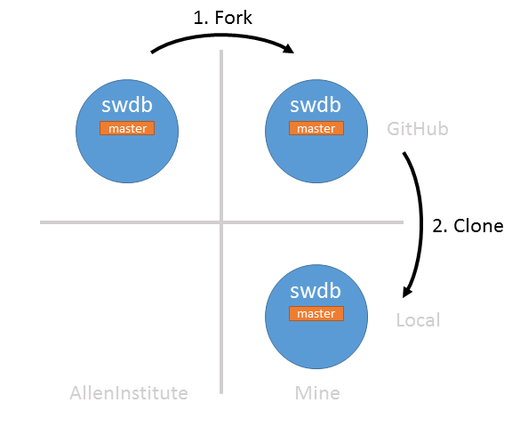
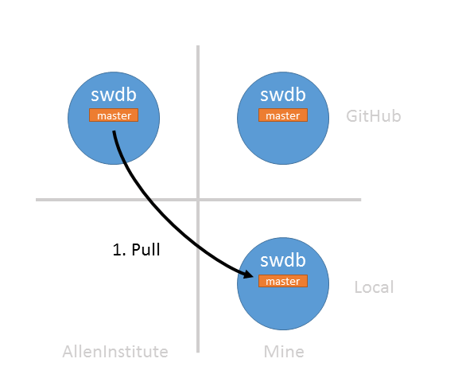
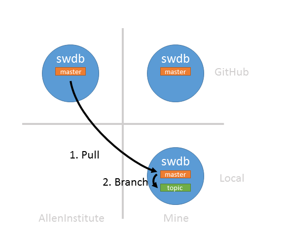
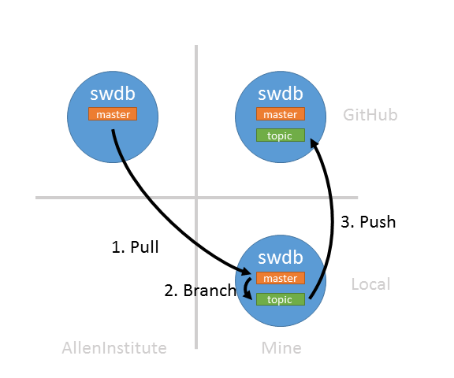
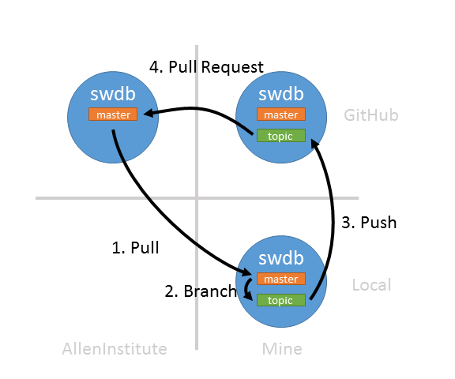
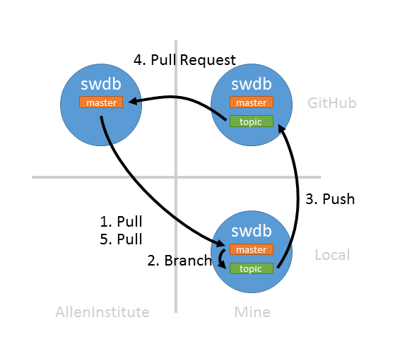

# git lesson 3: Working with Github

This material assumes that you have worked through the previous lessons.  At this point you should understand:

* How to create a repository on your computer
* Stage and commit changes to your repository
* Create topic branches
* Merge topic branches back to your master branch

## Overview: Why this (relatively complex) workflow?

GitHub is an online code collaboration platform centered around `git`.  This lesson shows you a particular way to use `git` and GitHub that is focused on collaboration.  We are trying to solve a few problems here.

1. We want to contribute changes to a repository owned by someone else
2. We want to control when to use changes from that repository
3. We want to minimize nasty merge conflicts 

The rest of these instructions boil down to a few practices:

1. Work in a fork
2. Work in topic branches, not the master branch
2. Use pull requests

Let's get started.

## Create a repository and copy it to your computer (forking and cloning)

 
The first thing you should do is create a repository on GitHub.  While you can always create an new repository, in this lesson we will be showing you how to collaborate with others on a single repository.  You will do this by creating a copy of an existing repository.  In `git` parlance, creating a copy of a repository is called `forking`.  

#### Fork a repository

Do this:

1. Go here: [https://github.com/alleninstitute/swdb_2018_tools](https://github.com/alleninstitute/swdb_2018_tools)
2. Click the 'Fork' button. 
3. If prompted, tell GitHub to clone the repository to your profile.

You now have a copy of the `swdb_2018_tools` repository all to yourself!

#### Clone your fork to your computer

As before, we will be using `GitKraken` when using `git` on your computer.  Now we want to make changes to the fork we just created, so let's bring it down to our computers.

1. Open `GitKraken`
2. File => Clone Repo
3. Github.com
4. Choose a location on your computer to save the repository ("Where to clone to")
5. Browse to your fork (`<user_name>/swdb_2018_tools`)
6. Click "Clone the repo!", then "Open Now!"

## The virtuous collaborative loop -- integrating changes and making your own

You now have two copies of someone else's repository -- your fork on GitHub and the one on your computer.  Those repositories all have a `master` branch.  An important principle to remember:

> **Leave the `master` branch alone**. 

> `master` is a shared resource, and it should always reflect the state of the primary repository's `master` branch

Of course it's possible to work in the master branch directly, but you should prefer topic branches for two reasons:

1. What if you want to work on two different things at once?
2. Editing master directly creates a parallel history that is inconsistent with the primary repository.  

We'll now describe a process you can use to integrate others changes and make changes safely.  But first...

#### Tell GitKraken about AllenInstitute/swdb_2018_tools

Right now your repository only knows about your fork on GitHub (`user_name/swdb_2018_tools`, AKA `origin`).  In order to make changes from others, we need our repository to know where these changes are coming from.  We only need to do this once.

1. Click the "+" in the "Remote" section on the left.
2. Paste in: https://github.com/alleninstitute/swdb_2018_tools
3. Accept the default name ("AllenInstitute")

Now the `AllenInstitute` remote appears above your fork (`origin`) in the list below with its default branch (`master`).

#### Loop Step 1: Pull changes from AllenInstitute to your computer

Now we want to bring some changes from `AllenInstitute/master` down to your local master branch.  

1. Right-click the `AllenInstitute` remote and click "Fetch AllenInstitute".  This just checks Github for changes.
2. Right-click the `AllenInstitute/master` branch and choose "Fast-forward changes from AllenInstitute/master".

That's it -- now you've incorporated changes from `AllenInstitute/master` to your local repository.  You can now update your GitHub fork's master branch by clicking "Push".

#### Loop Step 2: Create a topic branch and make a change

Now we want to make some changes to this repository.  Not the AllenInstitute copy (yet) -- just your local copy.

Topic branches are great because they let you work on multiple things at the same time.  In this case, they are necessary because remember: **don't touch the `master` branch**.  So let's make our changes in a topic branch!

1. Click the 'Branch' icon at the top of the screen.  Give it a cool name.
2. Make some changes that won't conflict.  Leave GitKraken and create a file in the repo directory named after your Github user name.
3. Gitkracken will notice the change -- click "View Change" in the upper right panel.
4. Mouse-over your new file and click "Stage File"
5. Type a commit message.
5. Click "Commit changes to 1 file"

#### Loop Step 3: Push your branch to your fork on Github

Our topic branch is ready, and we'd like to get our changes integrated into `AllenInstitute/master`.  GitHub has a great facility for this, so we need to get your changes up to your GitHub fork.  Remember: we always want `master` to be consistent with `AllenInstitute/master`, so we aren't going to merge the topic branch back into `local/master`.  Instead, we are going to push your topic branch up to your fork and integrate it into `AllenInstitue/master` from there.

1. Right-click your branch, then click "push"
2. Name your branch on Github (use the default, which is the same name)
3. Click "Submit"

Note: in GitKraken, when you click "push" you are pushing to `origin`, which is your fork on GitHub.

#### Loop Step 4: Issue a pull request to AllenInstitute/master

We have your topic branch up on your GitHub fork.  Now we want to merge your changes into `AllenInstitute/master`.  We ask for this via a "Pull Request":

1. Open Github to http://github.com/user_name/swdb_2018_tools
2. Github will notice your new branch.  Click "Compare and Pull Request".
3. Write a short description.
4. Click "Create pull request"
5. **wait for the instructor to accept the pull request** 
6. Click "delete branch" to delete your topic branch.

Pull requests are great.  We are working on a shared repository, so we really want to make sure that your changes are ready to integrate before pulling the trigger.  Pull requests give everyone a mechanism to review and propose new changes before updating the `master` branch.

#### Loop Step 5: Bring your own change back down to local/master

Once your request has been approved, `AllenInstitute/master` is now has your changes in it.  Just bring your changes back down to `local/master` and we're done.

1. Check out `local/master` by double clicking on it.
2. Right-click the `AllenInstitute` remote and click "Fetch AllenInstitute".  This just checks Github for changes.
3. Right-click the `AllenInstitute/master` branch and choose "Fast-forward changes from AllenInstitute/master".
4. Delete your topic branch: Right-click `cool_named_branch`, choose `Delete`.

If you want to update your GitHub fork's master branch, just click "Push".

#### All together now

